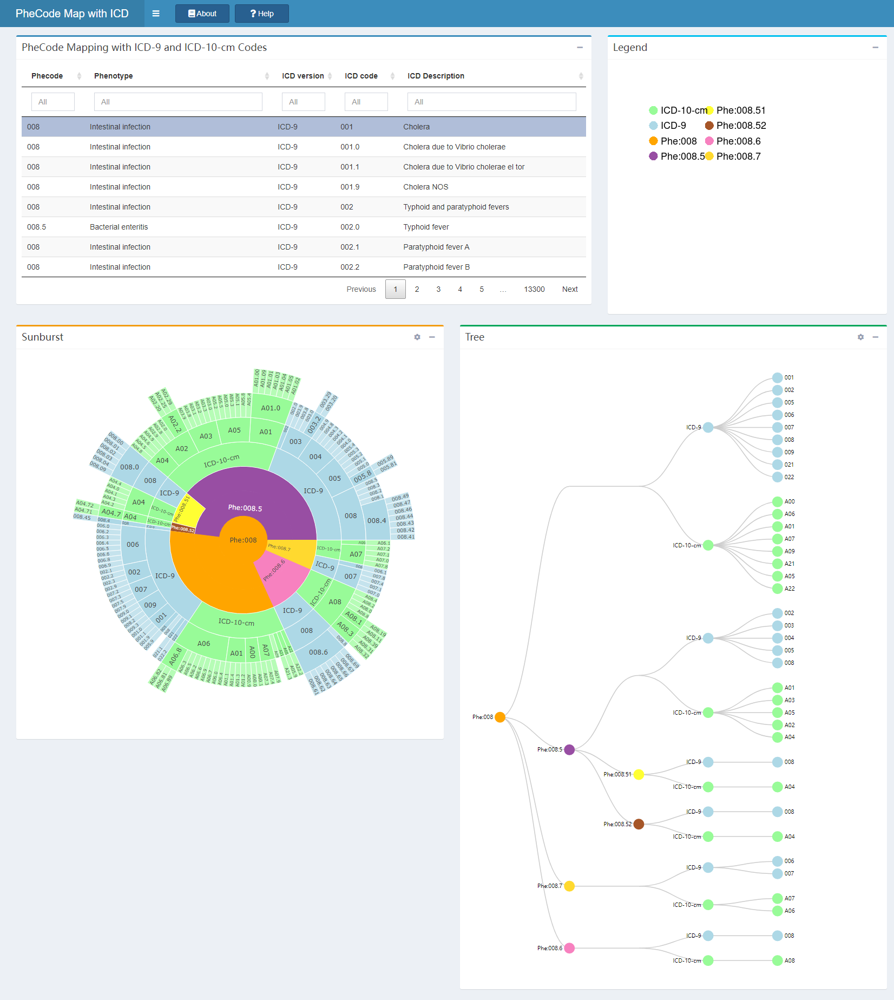
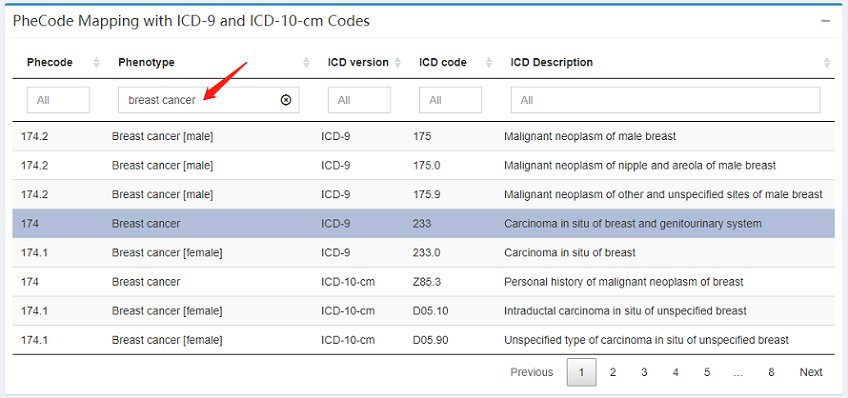
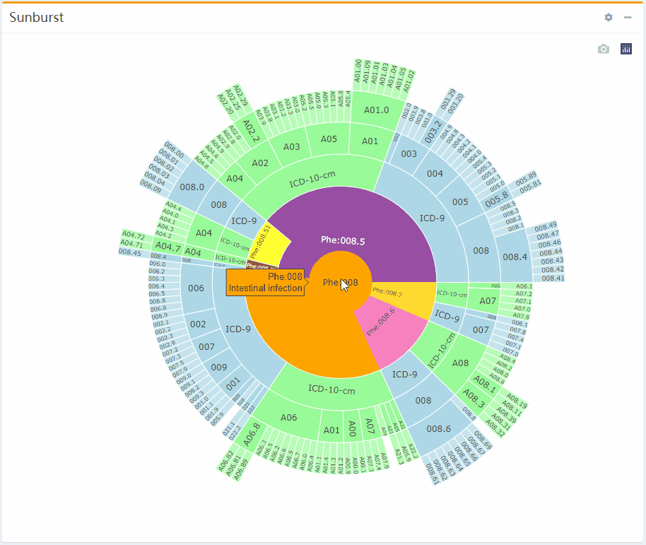
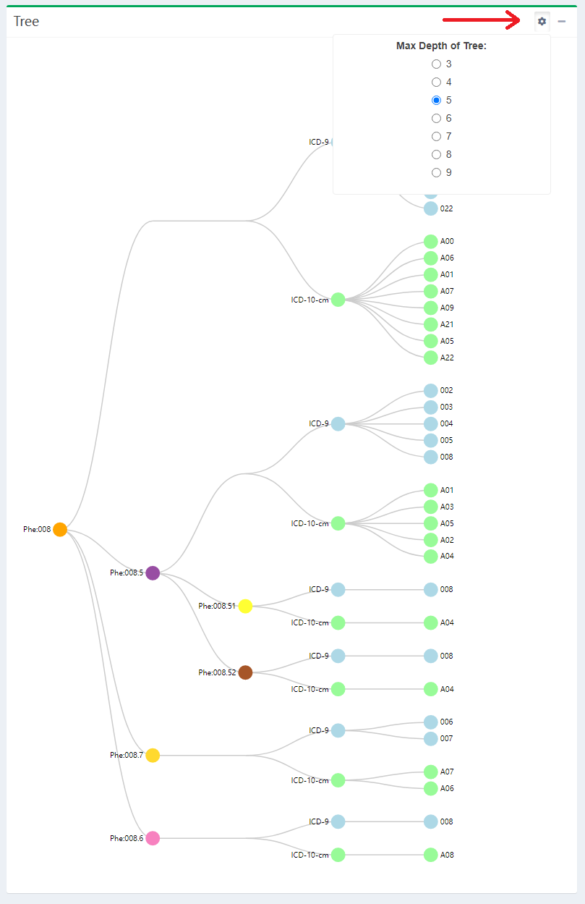

## Overview

The phecodemap package builds a shiny app to visualize the hierarchy of 
PheCode Mapping with ICD-9 and ICD-10-cm. The same PheCode hierarchy is 
displayed in two ways: as a sunburst plot and as a tree.

There are 5 parts in the website: header, input table, legend, sunburst, tree plot.

### header

- About: The instructions of the app. 
- Help: The step-by-step introduction of the app.

The documentations of the `About` and `Help` are in inst/app/doc.

### Input table

First of all, click a row in the input table. You can also enter some items in the filtering bar for each column (phenotype, ICD description etc.) to spot on your targets. Once a row are selected, the app will automatically display the hierarchy with the selected phecode as root node in the sunburst and tree plot.

### sunburst

- Hover on a wedge to see the label of the code.
- Click on a wedge to expand/collaspe the hierarchy.

### tree plot

- Hover on a node to see the label of the code.
- Click on a node to expand/collaspe the subtree.
- Set the maxdepth to 9 to see the full tree in Setting.

